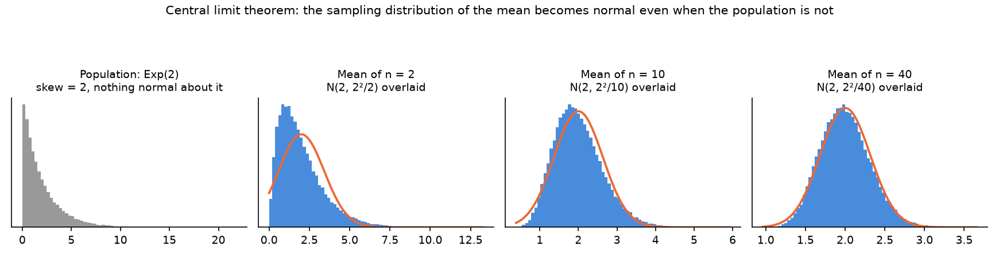
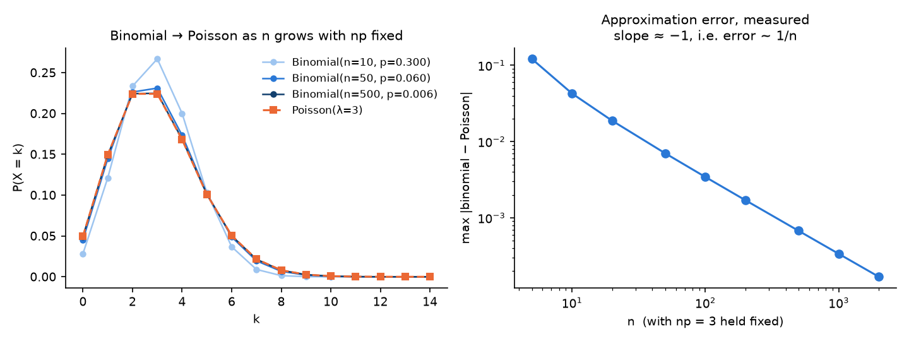
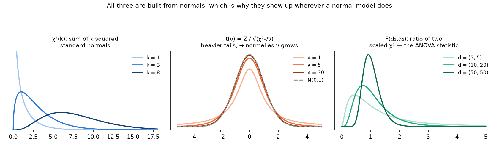
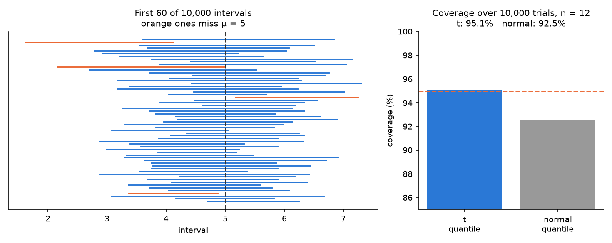
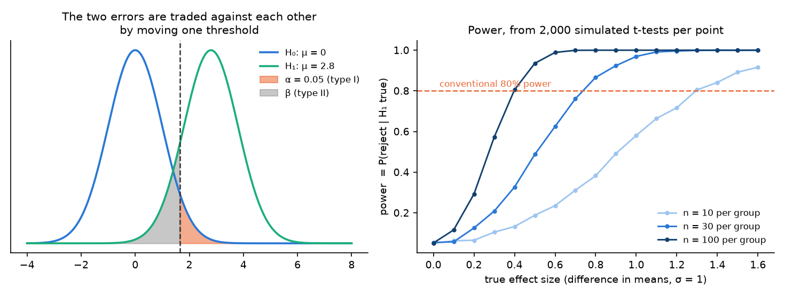

# Mathematical_Statistics
Study notes on mathematical statistics for data science

# 1. Probability and distributions
### 1.1. Probability
- Random variable: a variable whose value is determined probabilistically (e.g., in the coin-toss example, which face is up when the coin is tossed)
- Probability distribution: a table/figure/functional expression listing all the values a random variable can take and the probability with which those values appear (e.g., in the coin-toss example, the function telling us the probability that the upper face is heads (tails))
- Probability: a value expressing, as a number between 0 and 1, the possibility that some event has occurred (e.g., in the coin-toss example, the value of the possibility that the random variable is heads (tails))
- Event: the set of outcomes that can be observed from a random variable
- Sample space: the set of all possible events
- In P(X = head) = p, P is the probability distribution, X is the random variable, head is the event, and p is the probability

### 1.2. Probability distribution
- Uniform distribution: a distribution whose probability is the same regardless of what the event is
- Bernoulli distribution: a distribution in which the random variable X takes two values (0 or 1) → it can handle a great many problems involving a two-outcome trial, such as survival/death or good/defective
  - 
  - "P(X = x)": the probability that the random variable X takes the value x (for example, 1)
  - The p after ";" means that p is given as a parameter
    - Parameter of a probability distribution: a number expressing a characteristic of the probability distribution (e.g., the probability of heads for a coin in the Bernoulli distribution; the mean and variance in the normal distribution. In statistics, parameters are always written with Greek letters)
  - "{": looking at the various cases of x separately
  - Properties
    - 

- Support: the set of values of the random variable x whose probability is not 0 in the probability distribution (that is, a possible event (e.g., head, tail) can become part of the support, whereas an impossible event (e.g., tossing a coin and it landing on edge, neither head nor tail) has probability 0 because it cannot occur, and therefore cannot become part of the support)

### 1.3. pmf vs pdf
- Discrete probability distribution: the probability distribution when the values of the random variable X are discrete (e.g., the Bernoulli distribution)
  - The values of a random variable defined on a discrete sample space are finite or countably infinite
  - Types: Bernoulli distribution, binomial distribution, geometric distribution, multinomial distribution, Poisson distribution
- Continuous probability distribution: the probability distribution when the values of the random variable X are continuous (e.g., the continuous uniform distribution)
  - The values of the random variable are infinite and uncountable
  - Integration is used to obtain the area when computing the probability value of a continuous random variable (e.g., below is the expression solving the continuous uniform distribution)
  - Types: uniform distribution, normal distribution, chi-squared distribution, t-distribution, F distribution
  - Probability mass function (pmf) of the binomial distribution
    - 

- Probability mass function: the probability function for a discrete probability distribution, assigning a probability to each of the values x1, ..., xn of the discrete random variable X
- Probability density function: the probability function for a continuous probability distribution; the random variable X takes all values in some interval [l, u], and f(x) is the function on that interval
  - In a probability density function, X takes arbitrary real values within the given range (sample space)

### 1.4. Normal distribution
- Normal distribution: one of the continuous probability distributions, and a distribution commonly seen in nature. The Gaussian distribution
  - Characteristics: symmetric and bell shaped
- CLT (Central Limit Theorem): the theorem that the distribution of the sample mean follows a normal distribution

  - The figure samples from Exp(2), which is strongly skewed, and averages n of them. At n = 2 the mean is still visibly skewed; by n = 40 it matches N(2, 2²/40) closely. The theorem is about the sampling distribution of the mean, not about the data — the population on the left never becomes normal.
- Standard normal distribution (Z-distribution): a normal distribution with mean 0 and standard deviation 1
  - Every normal distribution can be transformed into the standard normal distribution.
  - The process of transforming an arbitrary normal distribution into the standard normal distribution
    1. Write a normal distribution with mean μ and variance σ² as follows: X ~ Normal(μ, σ²)
    2. Y(Z-score) = (X - μ) / σ
    3. Y ~ Normal(0, 1)

### 1.5. Binomial distribution
- Binomial distribution: the distribution extending the Bernoulli distribution, which handled success/failure in a single trial, to n trials. That is, the sum of n Bernoulli trials
  - 
  - First term: the combination; second term: the number of successes x; third term: the number of failures, n-x
  - Mean of the binomial distribution: np, variance: np(1-p)
    - 
    - With n fixed, the variance grows as p approaches 0 or 1, and the variance is minimized when p is 0.5

- Multinomial distribution: binomial distribution (0 or 1) → multinomial distribution (n1, n2, n3, ...)

- Parameter space: the space in which a parameter can take meaningful values
  - Parameter space of the binomial distribution: n is an integer greater than or equal to 1, and p is a real number between 0 and 1
  - Parameter space of the normal distribution: the mean is any real value, and the variance is a real number greater than 0

### 1.6. Poisson distribution
- Poisson distribution: the probability distribution for "the number of occurrences of an event within a unit of time/space" (e.g., how many purchases occurred in one hour)
  - 
  - Characteristic: both the mean and the variance are the same parameter λ
    - When doing Poisson-related modelling on real data, overdispersion is often present, and the negative binomial distribution is sometimes used to deal with it
    - Overdispersion: the case where the variance is larger than the mean
  - The Poisson distribution can also be derived from the binomial distribution. When n is very large and p is small in a binomial distribution, it can be approximated by a Poisson with λ = np

    - The right panel measures the approximation error rather than asserting it: with np held at 3, the maximum difference between the binomial and Poisson pmfs falls as 1/n on a log-log plot.
    - A representative example: the number of typographical errors that can appear on one page of a book
    - Among a great many characters (n is large), the number of typos is very small (p is small). From the Poisson viewpoint, each page can be regarded as a unit of space and the number of typos per page can be regarded as following a Poisson

### 1.7. Standardization and Normalization
- Scaling: adjusting the scale of numbers. The representative methods are standardization and normalization, and the shape of the data distribution is not changed
- Standardization: the transformation that sets the mean to 0 and the standard deviation to 1
  - 

- Normalization: the transformation that sets the minimum to 0 and the maximum to 1
  - 

### 1.8. Negative binomial distribution
- The Poisson has one parameter doing two jobs: λ is both the mean and the variance. Real count data rarely obliges, and when the variance exceeds the mean the Poisson is misspecified — this is the overdispersion noted in 1.6.
- The negative binomial adds a second parameter so the variance is free:
  - Var(X) = μ + μ²/r, which is the Poisson variance μ plus an extra term
  - As r → ∞ the extra term vanishes and the negative binomial converges to the Poisson
- Two readings of the same distribution
  - **Counting form**: the number of failures before the r-th success in Bernoulli trials, P(X = k) = C(k+r−1, k) pʳ(1−p)ᵏ
  - **Gamma-Poisson mixture**: draw λ from a Gamma distribution, then draw a Poisson with that λ. Marginally the result is negative binomial. This is the reading that explains the extra variance — the rate itself varies between units
- Which is why it is the default replacement for a Poisson regression whose residual deviance is far above its degrees of freedom.

# 2. Expectation, and more distributions
### 2.1. Expectation
- Expectation: the expected value is a concept generalized beyond a simple average
  - Not one particular value being predicted or estimated, but the average of the predicted values that are expected
  - That is, an average that takes the concept of a probability distribution into account
    - The probabilistic average value that determines the character of the probability distribution (the centre of mass, the balance point)
    - In the probability distribution represented by the random variable, the central tendency / the expected location (that is, the representative value expected as the centre)
  - In the end, a probabilistic weighted average taken over the random variable that carries the probability distribution

### 2.2. Independence
- Conditional probability: the probability that one event occurs under the assumption that a given event has occurred
  - 
  - Numerator: the meaning that event A and event B occurred simultaneously; denominator: the meaning that event B occurred
  - That is, the probability that event A and event B occurred simultaneously, given that event B occurred
- Independence: that the probability of one of the two events occurring has no effect on the probability of the other event occurring
  - Independence is about seeing, through the probability distribution, whether certain events or characteristics are related
  - 
  - That is, if the conditional probability equals the original probability, the two events are independent
- Dependent: a relationship that is not independent

### 2.3. Sample & statistic
- **Random sample**: X₁, …, Xₙ independent and identically distributed from the population. Independence is the assumption that does the work, and it is the one violated most often in practice
- **Statistic**: any function of the sample that contains no unknown parameters. X̄ is a statistic; (X̄ − μ)/σ is not, because it needs μ and σ
- A statistic is itself a random variable, and its distribution is the **sampling distribution**. Confusing the distribution of the data with the distribution of a statistic computed from it is the single most common source of error in applied statistics
- For an iid sample from a population with mean μ and variance σ²:
  - E[X̄] = μ — the sample mean is unbiased
  - Var(X̄) = σ²/n — precision improves with n, but only as √n, which is why halving a standard error costs four times the data
- **Why the sample variance divides by n − 1**: using the sample mean in place of μ makes the deviations systematically too small, since X̄ is the value that minimizes the sum of squared deviations for this particular sample. Dividing by n − 1 instead of n corrects exactly that bias, and n − 1 is the number of deviations still free once X̄ is fixed

### 2.4. Chi-squared distribution
- If Z₁, …, Z_k are independent standard normals, then Σ Zᵢ² ~ χ²(k). The parameter k is the degrees of freedom
- Mean k, variance 2k, and it is right-skewed, becoming more symmetric as k grows
- Why it appears wherever a variance does: for a normal sample, (n−1)S²/σ² ~ χ²(n−1). The n − 1 rather than n is the same lost degree of freedom as in 2.3
- **Cochran's theorem** is why S² and X̄ are independent for a normal sample, which is exactly what makes the t statistic below have a clean distribution
- Uses: the variance test, the goodness-of-fit test, and the test of independence in a contingency table

### 2.5. F and t distribution
- **t distribution.** t = Z / √(χ²ᵥ/ν), a standard normal divided by the square root of an independent scaled chi-squared. This is what the z statistic becomes when σ is unknown and has to be estimated from the same data
  - Heavier tails than the normal, because the denominator is itself random and sometimes small
  - Converges to N(0,1) as ν → ∞; by ν ≈ 30 the difference is small, which is where the folk rule about "n > 30" comes from
- **F distribution.** F = (χ²_{d₁}/d₁) / (χ²_{d₂}/d₂), a ratio of two scaled chi-squareds
  - It is the ratio-of-variances distribution, and hence the distribution of the ANOVA statistic in section 4
  - t² with ν degrees of freedom equals F(1, ν) — the two-sample t-test and a one-way ANOVA on two groups are the same test

- All three are built out of normals, which is why they turn up together: the moment a model assumes normal errors, the variance follows a chi-squared, the standardized mean follows a t, and the ratio of two variances follows an F.

### 2.6. Cumulative distribution function
- F(x) = P(X ≤ x). It is defined for every random variable, discrete or continuous, which is what makes it more general than the pmf or the pdf
- Properties: non-decreasing, right-continuous, F(−∞) = 0, F(∞) = 1
- For a continuous variable, F'(x) = f(x) — the density is the derivative of the CDF, which is the fundamental theorem of calculus doing its usual job
- **Inverse transform sampling**: if U ~ Uniform(0,1) then F⁻¹(U) has distribution F. This is how a random number generator that produces uniforms produces anything else
- **Probability integral transform**: conversely, F(X) ~ Uniform(0,1) when F is the true CDF of X. This is the basis of the p-value being uniform under the null hypothesis, and of QQ plots

### 2.7. Quantile
- The q-th quantile is the value x with F(x) = q, i.e. x = F⁻¹(q). The median is q = 0.5, the quartiles are q = 0.25, 0.75
- Quantiles are what make robust statistics possible: the median has a breakdown point of 50% while the mean has one of 0, meaning a single arbitrarily large observation moves the mean anywhere and moves the median hardly at all
- **QQ plot**: plot the sample quantiles against the theoretical ones. A straight line means the distributional assumption holds; a curve at the ends means the tails are heavier or lighter than assumed. This is a far more sensitive check of normality than a histogram
- Quantile regression models the conditional quantile rather than the conditional mean, which is what to reach for when the interest is in the tail of the response rather than its centre

### 2.8. Compare means
- **One-sample t-test**: t = (X̄ − μ₀) / (S/√n), compared against t(n−1)
- **Two-sample t-test**: t = (X̄₁ − X̄₂) / SE, with the standard error depending on which variance assumption is made
  - Pooled (Student's) assumes equal variances; **Welch's does not**, and Welch is the better default because the equal-variance assumption is rarely checked and the cost of Welch when variances *are* equal is negligible
- **Paired t-test**: when the observations come in pairs, test the differences with a one-sample test. Pairing removes between-subject variance and is why a paired design needs far fewer subjects for the same power
  - This is the same reason paired-organ data has to be analysed at the patient level, not the organ level: two organs of one patient are not two independent observations
- Assumptions: independence between observations, approximate normality of the sampling distribution (which the CLT provides for moderate n), and — for the pooled version only — equal variances
- **Effect size, not just significance.** Cohen's d = (X̄₁ − X̄₂)/s reports how large the difference is; the p-value only reports how surprising it would be under the null. With a large enough n, a difference of no practical importance is significant

### 2.9. Secretary problem
- The optimal stopping problem: n candidates arrive in random order, each must be accepted or rejected immediately, and only the relative rank is observed. Maximize the probability of selecting the best one
- The optimal policy is a threshold rule: **reject the first n/e candidates outright, then take the first one better than everything seen so far**
- The success probability is 1/e ≈ 0.368, and it does not decay with n — which is the surprising part
- Sketch of why: with a cutoff at position k, the probability of success is (k/n) Σ_{i=k+1}^{n} 1/(i−1) → x·ln(1/x) for x = k/n. Differentiating gives x = 1/e
- It appears here because it is the cleanest example of a decision rule derived from a distribution rather than from data, and the same structure — explore for a while, then exploit — is the shape of the exploration/exploitation trade-off in bandits and reinforcement learning

# 3. Point estimation and interval estimation
### 3.1. What makes an estimator good
- **Unbiasedness**: E[θ̂] = θ. Desirable but not decisive — a biased estimator with small variance often beats an unbiased one with large variance
- **Consistency**: θ̂ → θ as n → ∞. This is the minimum requirement; an inconsistent estimator does not improve with data
- **Efficiency**: among unbiased estimators, the one with the smallest variance. The **Cramér-Rao bound** Var(θ̂) ≥ 1/I(θ) sets the floor, where I(θ) is the Fisher information
- **Mean squared error** decomposes the trade-off: MSE = bias² + variance. This is the same decomposition as the bias-variance trade-off in machine learning, and it is why regularization — which adds bias — can lower total error

### 3.2. Methods of estimation
- **Method of moments**: equate sample moments to population moments and solve. Simple, and it always produces something, but it can produce estimates outside the parameter space
- **Maximum likelihood**: maximize L(θ) = Π f(xᵢ; θ), in practice the log-likelihood. MLE is consistent, asymptotically normal and asymptotically efficient — it attains the Cramér-Rao bound in the limit
  - Worked example: for a normal sample the MLE of μ is X̄, and the MLE of σ² is the sample variance with divisor **n**, which is biased. The n − 1 version is the unbiased correction, which is a concrete case of MLE not being unbiased
- **Bayesian estimation**: combine a prior with the likelihood to obtain a posterior, and report its mean or mode. The MAP estimate coincides with the MLE under a flat prior, and an L2 penalty is exactly a Gaussian prior on the parameters

### 3.3. Interval estimation
- A point estimate without an interval says nothing about its own precision
- A 95% confidence interval for a normal mean: X̄ ± t_{0.975, n−1} · S/√n
- **What the 95% means**, precisely: it is a statement about the procedure, not about a particular interval. Repeat the experiment many times and 95% of the intervals constructed this way will contain the parameter. It is *not* the probability that this interval contains θ, since θ is fixed and the interval either contains it or does not

- The figure builds 10,000 intervals from 10,000 samples of size 12 and counts how many contain the true mean. The t-based intervals cover at the nominal rate. The same intervals built with 1.96 instead of the t quantile under-cover — the width the t distribution adds at small n is not conservatism, it is what makes the stated coverage true
- **Bootstrap** intervals resample the data itself and take quantiles of the resampled statistic. They need no distributional assumption and are what to use when the sampling distribution of the statistic is unknown
# 4. Hypothesis testing: t-test and ANOVA
### 4.1. The structure of a test
- State H₀ and H₁, choose α, compute a statistic, compare it to its distribution under H₀, and either reject H₀ or fail to reject it. **Failing to reject is not accepting** — absence of evidence, evidence of absence
- **Type I error** (α): rejecting a true H₀. **Type II error** (β): failing to reject a false one. **Power** = 1 − β

- The left panel shows why the two errors cannot be reduced together by moving the threshold: shrinking one region grows the other. The only way to improve both is more data or a larger effect
- The right panel measures power by running 2,000 t-tests at each effect size for three sample sizes. It makes the practical point concretely: at n = 10 per group, an effect of 0.8σ is detected less than half the time, so a null result from a small study is uninformative rather than negative
- **p-value**: the probability, under H₀, of a statistic at least as extreme as the one observed. It is not the probability that H₀ is true, and it is not a measure of effect size

### 4.2. t-test
- Covered in 2.8. The key assumption is on the sampling distribution of the mean, not on the data itself, which is why the CLT makes the t-test robust for moderate n even with non-normal data

### 4.3. ANOVA
- With three or more groups, running all pairwise t-tests inflates the type I error: at α = 0.05 with 3 groups there are 3 comparisons and P(at least one false positive) ≈ 14%; with 5 groups there are 10 comparisons and it is 40%
- ANOVA tests all groups at once with a single statistic. It **partitions the total variance**:
  - SS_total = SS_between + SS_within
  - F = (SS_between / df_between) / (SS_within / df_within)
- Under H₀ (all group means equal) this ratio follows F(k−1, N−k) — the same F distribution constructed in 2.5
- The logic: if the groups genuinely differ, the variation *between* group means is large relative to the variation *within* groups. F is exactly that comparison
- ANOVA is an omnibus test — a significant F says the means are not all equal, not which pair differs. **Post-hoc** tests (Tukey's HSD, Bonferroni) answer that while controlling the family-wise error rate
- Non-parametric alternatives when the assumptions fail: Mann-Whitney U in place of the two-sample t-test, Kruskal-Wallis in place of one-way ANOVA

### 4.4. Multiple comparisons
- The problem generalizes past ANOVA: testing m hypotheses at α gives a family-wise error rate of 1 − (1 − α)^m
- **Bonferroni** controls the family-wise error rate by testing each at α/m. Simple and conservative
- **Benjamini-Hochberg** controls the false discovery rate — the expected proportion of false positives among rejections — which is the more useful target when m is large, as in a screening study

# Practical Statistics for Data Scientists
## New 1. Exploratory data analysis (practice/Practice EDA~.ipynb)
- Exploratory data analysis: grasping the tendencies of complex data through summary statistics (mean, median, quantiles, etc.) and simple plots (box plots, scatter plots, etc.)
- Types of data
  - Numeric, continuous, integer (discrete), categorical, binary, ordinal
- Tabular data: the common way of representing data, made of rows and columns ~ in pandas this is the DataFrame structure (features are the columns, records are the rows)
  - features are used to predict outcome.
- 1. Estimates of location
  - The process of checking estimates that show roughly where the values of the data lie (central tendency)
  - Check the mean, weighted mean, median, percentiles, weighted median, trimmed mean, outliers, etc. + robustness
    - Weighted mean: the sum of the values multiplied by their weights, divided by the sum of the weights
    - Weighted median: after sorting the data, the data value at which the running sum of the weights from the top reaches the middle of the total. It can be obtained using the median() function of the wquantiles package
    - Trimmed mean: the mean of the remaining values after excluding a fixed number of extreme values ~ use the trim_mean function in scipy.stats
- 2. Estimates of variability
  - The process of checking dispersion, which shows how densely packed or how spread out the data values are. It is generally based on deviations (e.g., the mean absolute deviation)
  - Check deviation, variance, standard deviation (the square root of the variance), mean absolute deviation (Manhattan norm, L1 norm), median absolute deviation from the median (MAD), order statistics, range, percentiles, and the interquartile range (IQR)
    - Mean absolute deviation: the mean of the absolute values of the deviations from the mean (taking the mean of the deviations themselves is undesirable, because negative deviations cancel positive ones)
    - Median absolute deviation from the median: the median of the absolute values of the deviations from the median. Use the strong.scale.mad() function of the statsmodels package
    - Order statistics: statistics representing sorted (ranked) data; the most basic measure is the range
    - Range: the difference between the maximum and the minimum (maximum - minimum). The range is highly sensitive to extreme values and so is not very useful for measuring the variability of data ~ overcome this by using the interquartile range (IQR)
  - Variance, standard deviation and mean absolute deviation are all non-robust to extreme values → a robust estimate of variability is the median absolute deviation from the median (MAD)
    - Variance and standard deviation are especially sensitive to extreme values because they use squared deviations
- 3. Exploring the data distribution
  - Mainly the process of finding out how the data is distributed overall
  - Visualize using box plots, frequency tables, histograms and density plots
    - Density plot: a plot showing a histogram as a smooth curve, mainly using kernel density estimation
- 4. Exploring binary and categorical data
     - For binary data it is enough to find out what proportion an important category such as 1 accounts for - it can be visualized using a bar graph (count plot or bar plot)
     - Categorical data can usually be summarized as proportions, and is mainly obtained by classifying it into the following two cases
       - When there are only a few categories: bar graph (count plot or bar plot), pie chart
         - The bar graph is similar to the histogram; statisticians and data visualization experts rarely use pie charts, on the grounds that they are not visually effective
       - When there are many categories: mode, expected value
- 5. Correlation
  - Investigating the correlation between the predicted value and the target value, an important method of bivariate analysis, grasped using a correlation matrix or a scatter plot
    - When X taking a large value goes with Y taking a large value, and X taking a small value goes with Y taking a small value, they are said to be correlated
  - Correlation coefficient: a measure used to indicate what kind of relationship exists between numeric variables (-1 to +1)
    - The closer the absolute value is to 1 the higher the correlation, and the closer it is to 0 the less correlation there is (+ positive correlation, - negative correlation)
  - Correlation matrix: a table whose rows and columns denote variables, where each cell means the correlation between the variables of that row and column
  - Scatterplot: a plot whose x-axis and y-axis represent two different variables
- 6. Bivariate analysis & multivariate analysis
  - Hexagonal binning, contour plot, heatmap, contingency table, violin plot
  - Hexagonal binning: instead of marking the data as points, a plot that divides the data into hexagonal bins and colours each bin according to the number of records it contains (can be visualized using the hexbin() function of the pandas package)
    - A scatter plot is fine when there are few data points but is unsuitable for representing a great many rows; this method is used as a replacement
    - 

  - Contour plot: a plot using contour lines on top of a scatter plot; density increases towards the "peaks" of the contours (can be visualized using the kdeplot() function of the seaborn package)
    - 

  - Contingency table: an effective method of summarizing two categorical variables; a table recording the frequency counts by category
    - 

  - Violin plot: a form that complements the box plot, simultaneously visualizing the density estimation result along the y-axis (can be visualized using the violinplot() function of the seaborn package)
    - Advantage: the distribution of the data, which is not visible in a box plot, can be seen (though the box plot shows extreme values and outliers more clearly)
    - 
